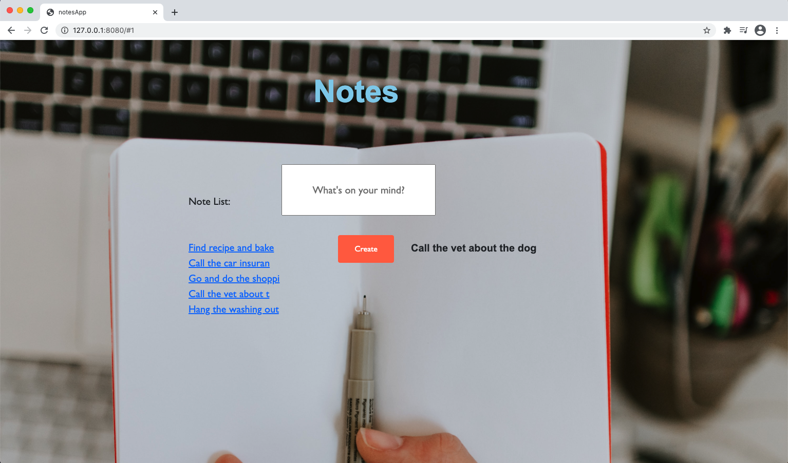

# Notes App

## Brief

The purpose of this project was to build a frontend, single-page web app using only Vanilla JavaScript, making requests to use data from an external API, while also extracting out a new testing framework from the app - without using any existing libraries.

## User Stories
```
  1.  As a programmer
      So I can find the one I want
      I can see a list of my notes, where each note is abbreviated to the first 20 characters

  2.  As a programmer
      So I can record something I need to remember
      I can create a new note

  3.  As a programmer
      So I can see all the information in the note
      I can see the full text of an individual note on its own page

  4.  As a programmer
      So I can record notes with fun little pictures
      I can use shortcodes like `:fire:` that get converted into emojis like 🔥
```
## Getting Started

The app is hosted on surge at the below address:

http://wonderful-hat.surge.sh/

Alternatively, you can also clone the repository from GitHub:
```
$ git clone https://github.com/PiperS52/notes-app.git
$ cd notes-app
```

Run the index.html:
```
$ open index.html
```

Or run on a local server, such as http-server:
```
$ npm install --global http-server
$ http-server ./
```


